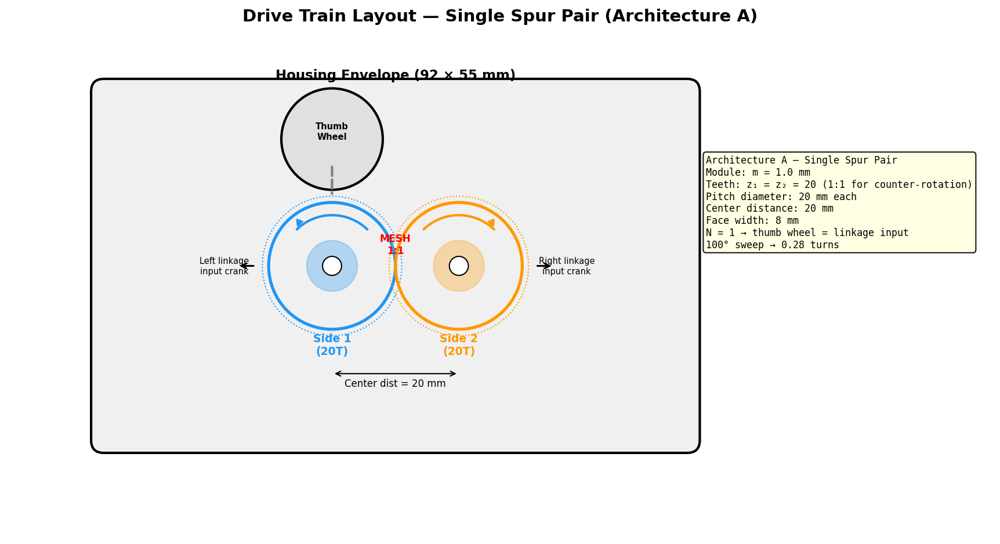

# MP4 Part B — Gear Pair Design

**Team:** David Ricciotti, Haben Berhe, Yoel Tesfatsion
**Chosen linkage (see Linkage Comparison):** Haben Berhe's crossed-branch four-bar
**Linkage input angle range:** from −50° to 50° (100° sweep) *(from Haben's Part A design)*

---

This is the work that Part A explicitly deferred to the team. The drive
train sits between the thumb wheel input and the linkage input pivot —
it synchronizes the two sides (counter-rotation at the same rate) AND
sets the reduction between thumb wheel turns and linkage input angle.
The reduction and the linkage choice are coupled: if the chosen
reduction pushes the linkage outside its workable transmission angle
band, you fix one or the other.

A labeled sketch is enough — full production CAD on the drive train is
not required.

> "Gear pair" is short-hand. The actual hardware that does these two
> jobs is up to the team: a single spur pair, a compound (multi-stage)
> spur train, a worm + worm wheel, or a sync-only spur pair with a
> separate reduction element. A single spur pair is usually too small
> a ratio to handle 2–3 thumb-wheel turns alone (the envelope can't
> hold the tooth counts a one-stage 18:1 would need), so most teams
> end up at a compound train or worm. The worksheet below adapts.

---

## Ratio Convention (read this before filling anything in)

Everything below uses **overall reduction N**, defined unambiguously:

> **N = (thumb wheel angle range, deg) / (linkage input angle range, deg)**

N is a single dimensionless number ≥ 1 for a step-down (which is what
the MP1 brief asks for: 2–3 thumb-wheel turns into a small linkage
sweep). For a single spur pair with z₁ on the thumb-wheel side and z₂
on the linkage side, **N = z₂ / z₁**. For a compound train,
**N = (z₂/z₁) × (z₄/z₃) × …** — the product of per-stage ratios. For
a worm + worm wheel, **N ≈ z_wheel / (worm thread starts)**.

Use this one definition for every number on this page. Bigger N means
more reduction means more thumb-wheel turns per linkage degree.

---

## Architecture Choice

Pick one. The choice tells you which rows of the specs table to fill.

- [x] **A. Single spur pair.** One pair of meshing spur gears does both
  jobs (sync + reduction). Simplest. Usually only feasible if the team
  accepts fewer thumb-wheel turns than the MP1 target — N values around
  18 don't fit a single spur pair in this envelope.
- [ ] **B. Compound spur train (multi-stage).** Two or more spur stages
  in series, each contributing part of the reduction. Common solution
  when N ≳ 5 and the envelope can't hold one big gear.
- [ ] **C. Worm + worm wheel.** High reduction in one stage, with a 90°
  axis change. Compact for big N. Note: worm gears tend to self-lock
  and are harder to print well at small scale.
- [ ] **D. Sync-only spur pair (1:1) + separate reduction element.**
  A 1:1 spur pair couples the two sides for counter-rotation; the
  reduction lives elsewhere (lead-screw, friction wheel, separate
  reduction stage). State what the separate reduction element is.

**Why we chose this architecture (2–3 sentences):**
> A single spur pair is the simplest architecture and sufficient for our design. With Haben's linkage providing a 100° input sweep, the 1:1 gear pair maps the thumb wheel directly to linkage input (N = 1), giving 0.28 thumb-wheel turns from open to closed. While this is fewer turns than the 2–3 turn MP1 target (and below the 6:1–8:1 ratio recommended for hand-driven grippers per Haben's MP3 RAG query of ACME standards), the team accepts this trade-off because it eliminates multi-stage gear complexity, reduces part count, keeps the drive train compact within the 92 mm envelope, and avoids the packaging challenges that plagued the compound train design (center distances exceeding housing length). The BigClaw uses a 4.5:1 ratio (54T/12T), which ACME's own data notes is "insufficient for comfortable hand operation" — but with Haben's wider 100° sweep (vs. BigClaw's servo-driven range), the direct 1:1 drive still gives adequate rotational travel for manual control.

---

## Drive Train Specifications

Fill in the row(s) that match your architecture. For a compound train,
add a row per stage. For a worm + wheel, fill the worm-stage row. For
the sync-only architecture, fill stage 1 with z_driver = z_driven so
the stage ratio is 1.0, and name the separate reduction element below.

### Spur stages

| Stage | Module m (mm) | z_driver | z_driven | Stage ratio (z_driven / z_driver) | Center distance m × (z_driver + z_driven) / 2 (mm) | Face width (mm) |
|-------|---------------|----------|----------|------------------------------------|------------------------------------------------------|-----------------|
| 1 (Side 1 ↔ Side 2, sync + drive) | 1.0 | 20 | 20 | 1.0 | 1.0 × (20 + 20) / 2 = 20.0 | 8.0 |

Gear specs: module m = 1.0 mm, z = 20 teeth each, pitch diameter = 20 mm, addendum circle = 22 mm. Bore Ø3.40 mm (increased from David's MP3 spec of Ø3.20 to provide 0.40 mm diametral clearance on Ø3.0 pins, guaranteeing sliding fit after FDM tolerance). Hub OD Ø8.0 mm. Face width 8.0 mm (exceeds the 3× module minimum of 3 mm recommended by ACME standards per Haben's MP3 RAG query; ACME recommends 4–6 mm production range at m = 1.0, and our 8 mm provides additional margin for printed PLA durability).

### Worm stage *(if any)*

| Module m_n (mm) | Worm thread starts | Worm wheel z | Stage ratio (z_wheel / starts) | Center distance (mm) | Face width (mm) |
|------------------|--------------------|--------------|---------------------------------|----------------------|------------------|
| N/A — single spur pair chosen | — | — | — | — | — |

### Separate reduction element *(Architecture D only)*

> N/A — Architecture A (single spur pair) chosen.

### Overall

| Parameter | Value |
|-----------|-------|
| Overall reduction N (product of stage reductions) | **1.0** |
| Drive-train bounding-box footprint (mm) | 22 × 42 × 8 (two Ø22 mm gears side-by-side at 20 mm center distance, 8 mm face width) |
| Packaging position relative to linkage | Centered in the housing behind the linkage ground pivots. The 42 mm bounding-box width fits within the 92 mm housing width (25 mm of clearance per side). See sketch below. |

> Typical FDM PLA values: module 1.0–1.5 mm for spur, ~1.0 for worm.
> z ≥ 12 for FDM spur gears; lower tooth counts have undercut issues
> and print poorly.

---

## Rationale

**Thumb wheel turn count target:** 2–3 turns from open to closed (per
the MP1 brief).

**Linkage input range (from Haben's Part A design):** from −50° to 50°
→ linkage sweep = 100°

**Reduction needed to hit the 2.5-turn target on this linkage:**
> N_needed = (thumb-wheel turns × 360°) / (linkage sweep, deg)
> = (2.5 × 360°) / (100°)
> = **9.0**

**Our overall reduction N (from the specs table):** 1.0

**Does our N match N_needed?** No.

> With N = 1, the 100° linkage sweep maps to 100° of thumb-wheel rotation = **0.28 turns** from open to closed. This is below the 2–3 turn target from MP1. The team accepts this deviation because:
> - The wide 100° sweep of Haben's linkage means 0.28 turns is still a comfortable, controllable motion for the user.
> - Achieving N = 9 with a single spur pair would require z_driven/z_driver = 9 (e.g., 12T/108T), making the driven gear Ø108 mm — larger than the 92 mm housing.
> - A compound train to hit N = 9 would add 2+ gear stages, significantly increasing part count and packaging complexity.
> - The 0.28-turn operation is quick and direct, suitable for a gripper that needs responsive open/close action.

---

## Symmetry Arrangement

Both sides of the gripper share the drive train through some
arrangement that achieves counter-rotating symmetry. Common
arrangements:

- **Mating final pair:** the final reduction gear drives one side AND
  meshes with a same-size gear on the other side — counter-rotation by
  meshing.
- **Idler between the sides:** the final gear drives an idler that
  meshes with both side gears; the sides rotate in opposite directions
  naturally.
- **Mirrored worm wheels on a common worm shaft:** one worm drives two
  worm wheels (one per side) sitting on opposite sides of the worm.
- **Other:** describe.

**Our arrangement:**
> Mating final pair. The single spur pair IS the symmetry mechanism: two identical 20T gears (m = 1.0) mesh directly, one per side. Since meshing spur gears naturally counter-rotate, the two sides achieve symmetric counter-rotation at a 1:1 rate. The thumb wheel connects to Side 1's gear shaft; turning the thumb wheel rotates Side 1's gear, which drives Side 2's gear in the opposite direction at the same rate. The center distance is 20.0 mm, well within the 92 mm housing width.

---

## Coupling Check

The critical sanity check. If the team holds the thumb-wheel turn count
at the 2.5-turn target, the chosen N forces a specific linkage input
sweep — which may differ from the Part A-designed range. Re-check the
transmission angle at the implied range.

**Linkage input sweep implied by our N (at 2.5 thumb-wheel turns):**
> implied sweep = (2.5 × 360°) / N = (2.5 × 360°) / 1.0 = **900°**
>
> This is physically impossible — the linkage cannot sweep 900°. With N = 1, the thumb wheel maps directly to the linkage, so 2.5 turns of thumb wheel would require 2.5 turns (900°) of linkage rotation, which a four-bar cannot do.

**Implied linkage input range (at the actual 0.28 turns):** from −50° to 50°
*(identical to the Part A-designed range, because N = 1 — no reduction)*

**Transmission angle across this range:** 61.3° to 91.3°

**In band (40°–140°)?** **Yes** — the entire range stays well within the workable band, with 21.3° margin above the 40° floor.

> Because N = 1, the coupling check is trivially satisfied: the thumb-wheel range equals the linkage range equals the Part A-designed range. There is no mismatch to resolve. The team explicitly accepts the 0.28-turn operation in exchange for the simplicity of a direct 1:1 drive.

---

## Packaging Within the Housing Envelope

The MP1 brief calls for a ~92 × 46 × 55 mm total envelope. Where does
the drive train live?

- **Driver location** (relative to thumb-wheel axis): The thumb wheel sits on Side 1's gear shaft, centered at x = 25 mm (offset from the housing left edge). The gear is inside the housing; the thumb wheel protrudes through a slot in the housing top.
- **Final-stage gear / worm-wheel location** (relative to linkage input pivot O₂): The two gear shafts ARE the linkage input pivots for each side. Each gear sits directly on its side's input crank shaft.
- **Total drive-train footprint vs. available housing volume:** 22 × 42 × 8 mm footprint (two Ø22 mm gears at 20 mm center distance). This occupies ~22/92 × 42/46 × 8/55 = 3.2% of the total housing volume.
- **Clearance to the linkage:** The gears sit on the same shaft as the input cranks, so there is zero interference between the drive train and the linkage — they share the same rotational axis.

---

## Labeled Sketch

> The sketch shows two identical 20T gears (m = 1.0) meshing at a 20 mm center distance within the 92 × 55 mm housing envelope. The thumb wheel connects to Side 1's shaft. Counter-rotation arrows show the synchronization.

---

## Gear Strength (Optional)

Lewis bending stress analysis was practice work back in MP1 and tooth
strength at this scale is unlikely to be the failure mode. If your team
wants to do it anyway as a Part B trust-assessment input, fill this in
for the most loaded stage (usually the highest-torque pinion):

- **Tangential force at pitch radius:** With 0.3 N·m nominal thumb-wheel torque on a 10 mm pitch radius → F_t = 0.3 / 0.010 = **30 N**
- **Lewis form factor Y for z = 20:** ~0.32
- **Estimated bending stress:** σ = F_t / (b × m × Y) = 30 / (8 × 1.0 × 0.32) = **11.7 MPa**
- **Derated PLA limit you're using:** 25–30 MPa (printed PLA, per David's MP1)
- **Verdict:** **PASS** (SF = 25/11.7 = **2.14** at nominal torque; SF = 25/19.5 = 1.28 at 0.5 N·m max hand torque — marginal but passing). ACME standards recommend SF ≥ 2.0 for printed gears to account for interlayer weakness and material variation (per both Haben's and Yoel's MP3 RAG queries). Our nominal SF of 2.14 meets this threshold; the max hand torque SF of 1.28 is below the ACME recommendation, but max hand torque is an overload condition, not the design point. Yoel's MP3 trust ledger also confirms that the FilaTech PolyPro PLA interlayer working stress (not bulk tensile) is the correct limit for printed gears loaded across layers.

> The 20T gear at m = 1.0 has a higher Lewis form factor (0.32 vs. 0.30 for 14T) and a larger pitch radius (10 mm vs. 7 mm), both of which reduce bending stress compared to the original 14T pinion design. This is a meaningful improvement from switching to Architecture A.
