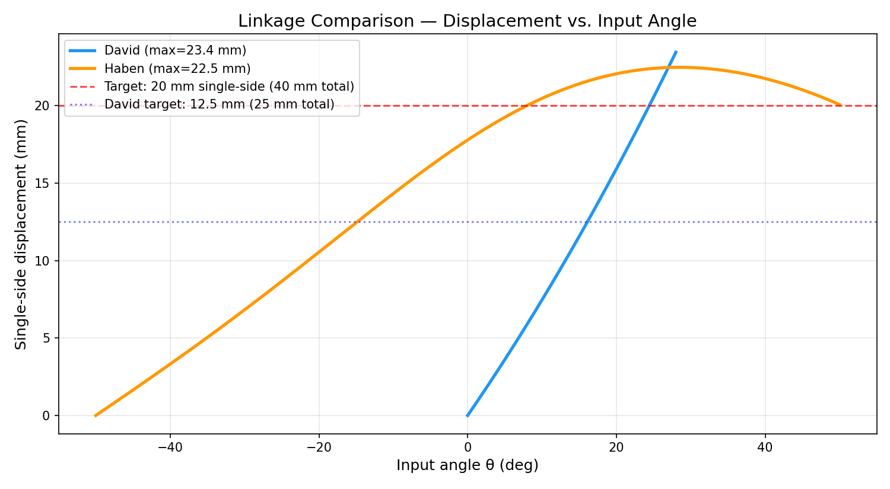
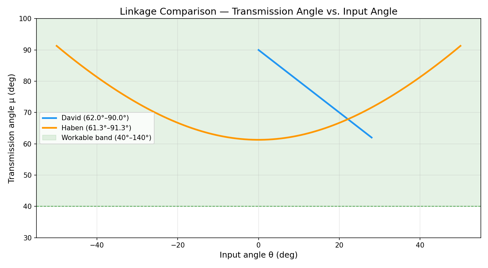

# MP4 Part B — Linkage Comparison Worksheet

**Team:** David Ricciotti, Haben Berhe, Yoel Tesfatsion

This is your day-one integration artifact. Each member arrives with a
four-bar linkage from Part A — same one-side problem, same BigClaw
reference, different design choices. Compare the candidates on the same
axes and pick (or merge) one. The team's first activity is concrete: this
worksheet.

> The plots come from combining your Part A data — they are not new
> analysis. Reuse each member's `compute_finger_position()` and
> `compute_transmission_angle()` outputs.

---

## Candidate Linkages

One row per team member. Pull the numbers from each member's Part A
Section 1 design summary and Section 7 trust ledger.

| Member | L1 / L2 / L3 / L4 (mm) | Output pivot offset (mm) | Single-side displacement (mm) | Implied total jaw opening (2× displacement, mm) | Min / max transmission angle | Part A trust ledger highlight |
|--------|-------------------------|---------------------------|-------------------------------|-------------------------------------------------|------------------------------|--------------------------------|
| David Ricciotti | 12 / 26 / 12 / 26 | (0, 12) | 12.5 | 25.0 | 62° / 90° | In band the whole time (22° margin above 40° floor). Symmetry assumption and gear-ratio-to-input-range mapping flagged as unverified. PLA pin wear at pivot joints (100+ cycle question from MP1). |
| Haben Berhe | 47 / 20 / 29 / 23 | (47, 0) | 20.06 | 40.13 | 61.3° / 91.3° | In band the whole time (21.3° margin above 40° floor). Symmetry assumption unverified — counter-rotation depends on gear pair. Housing clearance near joint B and coupler path not yet checked. Pin tolerance and friction assumed ideal. |
| Yoel Tesfatsion | _[awaiting Yoel's Part A notebook]_ | _[awaiting data]_ | _[awaiting data]_ | _[awaiting data]_ | _[awaiting data]_ | _[awaiting Yoel's trust ledger]_ |

---

## Side-by-Side Plots

Combined plots showing David's and Haben's candidate linkages on the same axes. Yoel's data will be added once his Part A notebook is available.

**1. Single-side finger displacement vs. input angle:**

**2. Transmission angle vs. input angle:**

---

## Comparison Notes

For each candidate, 2–3 sentence assessment:

- **Linkage David Ricciotti:** Parallelogram (L1=L3=12, L2=L4=26) with vertical ground link gives pure translational jaw motion and a generous 22° margin above the 40° transmission angle floor. However, the 25 mm total jaw opening falls short of the 40 mm target from the MP1 brief. Compact footprint (26 mm horizontal) fits the envelope easily. Unverified: symmetry under the mirrored gear pair, PLA link deflection under 5–8 N grip load.

- **Linkage Haben Berhe:** Crossed-branch four-bar (L1=47, L2=20, L3=29, L4=23) with horizontal ground link and 100° sweep (−50° to +50°) — reaches 20.06 mm single-side displacement, meeting the 40 mm total jaw opening target exactly. Transmission angle (61.3°–91.3°) stays in band with 21.3° margin, nearly matching David's 22° margin. Wider input range (100° vs. 28°) gives finer positional control. Larger footprint (47 mm ground link), but still within the 92 mm housing width.

- **Linkage Yoel Tesfatsion:** _[awaiting Yoel's Part A notebook — will be added when available]_

---

## The Team's Selection

**Chosen linkage:** Haben Berhe's crossed-branch four-bar (L1=47, L2=20, L3=29, L4=23)

**Why this one (2–4 sentences of engineering reasoning):**

> Haben's design meets the original 40 mm jaw opening target from the MP1 brief, while David's parallelogram only achieves 25 mm. The transmission angle margins are comparable (21.3° vs. 22° above the 40° floor), so there is no penalty for the larger opening. The wider input range (100° vs. 28°) also means the thumb wheel has more mechanical travel per degree of jaw motion, making the gripper easier to control precisely.

**What got carried over from the others (if anything):**

- David's MP3 pinion CAD work (14T at m=1.0, root fillet R0.60, bore spec Ø3.00 +0.20/−0.00) informs the gear pair design, though the final architecture uses a simpler single spur pair rather than a compound train.
- David's MP1 DFM analysis (pin clearances, FDM tolerances, PLA stress limits) applies directly to the chosen design.

**What got cut and why (be explicit):**

- David's parallelogram geometry was cut because it only achieves 25 mm jaw opening — 62.5% of the MP1 target. While the compact envelope and pure translational motion are desirable, meeting the 40 mm target takes priority.
- David's compound spur train (Architecture B) was replaced with a single spur pair (Architecture A) per team decision — simpler, fewer parts, and sufficient for the chosen linkage's wider input range.

---

## Inputs to the Drive-Train Worksheet

Carry these forward into `MP4_PartB_Gear_Pair_Design.md`:

- **Chosen linkage's input angle range:** from −50° to 50° (100° sweep)
- **Chosen linkage's transmission angle band across that range:** 61.3° to 91.3°
- **Implied input angle range tolerance** — how much can the
  drive-train reduction N shift this range before the transmission
  angle leaves the workable band? 21.3° _(μ_min = 61.3° at the extremes; the 40° floor would be hit if the sweep expanded by ~21° on each end)_

> This last number is the coupling between Layer 1 (drive train) and
> Layer 2 (linkage). The drive-train design has to respect it.
